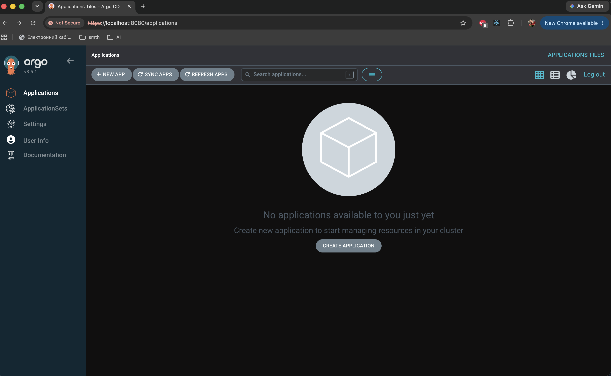

# AsciiArtify — Argo CD Proof of Concept

## Overview

The AsciiArtify team selected **k3d** as the local Kubernetes environment during the Concept stage.

The next step is to validate that a GitOps system can be deployed on the selected Kubernetes environment and provide the development team with access to its graphical user interface.

For this Proof of Concept, **Argo CD** was deployed to a k3d Kubernetes cluster and its Web UI was successfully accessed.

## Prerequisites

The following tools are required:

- Docker
- k3d
- kubectl
- GitHub CLI (`gh`) when running the environment in GitHub Codespaces

The PoC was tested in GitHub Codespaces using a Linux x86_64 environment.

## Create the Kubernetes Cluster

Create the k3d cluster:

```bash
k3d cluster create asciiartify
```

Verify that the Kubernetes node is ready:

```bash
kubectl get nodes
```

Expected result:

```text
NAME                       STATUS   ROLES
k3d-asciiartify-server-0   Ready    control-plane
```

## Install Argo CD

Create a dedicated namespace:

```bash
kubectl create namespace argocd
```

Install Argo CD using the official installation manifest:

```bash
kubectl apply -n argocd \
  -f https://raw.githubusercontent.com/argoproj/argo-cd/stable/manifests/install.yaml
```

Wait until all Argo CD pods are ready:

```bash
kubectl wait --for=condition=Ready pods --all \
  -n argocd --timeout=300s
```

Verify the installation:

```bash
kubectl get pods -n argocd
```

The following Argo CD components should be running:

- Application Controller
- ApplicationSet Controller
- Dex Server
- Notifications Controller
- Redis
- Repository Server
- Argo CD Server

Verify the services:

```bash
kubectl get services -n argocd
```

The `argocd-server` service exposes the Argo CD API and Web UI on ports `80` and `443`.

## Get Argo CD Admin Credentials

The initial Argo CD administrator username is:

```text
admin
```

Retrieve the automatically generated initial password:

```bash
kubectl -n argocd get secret argocd-initial-admin-secret \
  -o jsonpath="{.data.password}" | base64 -d && echo
```

> Do not store the generated administrator password in Git or other source control.

## Access the Argo CD Web UI

Forward the Argo CD HTTPS service to port `8080`:

```bash
kubectl port-forward svc/argocd-server -n argocd 8080:443
```

For a local Kubernetes environment, the UI can then be opened at:

```text
https://localhost:8080
```

A browser may display a certificate warning because Argo CD uses a self-signed certificate by default in this setup.

### Access from GitHub Codespaces

When the Kubernetes cluster runs inside GitHub Codespaces, an additional tunnel can be used to expose the forwarded port to the local machine.

First, keep the Kubernetes port-forward running inside the Codespace:

```bash
kubectl port-forward svc/argocd-server -n argocd 8080:443
```

On the local machine, authenticate GitHub CLI with Codespaces access if necessary:

```bash
gh auth login -h github.com
gh auth refresh -h github.com -s codespace
```

Find the active Codespace:

```bash
gh codespace list
```

Forward its port `8080` to the local machine:

```bash
gh codespace ports forward 8080:8080 -c <CODESPACE_NAME>
```

Then open:

```text
https://localhost:8080
```

Log in using:

```text
Username: admin
Password: <initial admin password>
```

## Demo

The terminal demo demonstrates:

1. Creation of the k3d Kubernetes cluster.
2. Verification of the Kubernetes control-plane node.
3. Creation of the `argocd` namespace.
4. Installation of Argo CD using the official manifest.
5. Waiting for all Argo CD components to become ready.
6. Verification of the running Argo CD pods and services.
7. Verification that the initial administrator secret was created.

### Terminal Demo

[](https://asciinema.org/a/49tnhAIhwVx1Kq2i)

_Click the terminal preview to open the recorded demo._

### Argo CD Web Interface

After configuring port forwarding and logging in with the initial administrator credentials, the Argo CD Web UI is successfully available:



The successful login confirms that Argo CD is installed, its API server is accessible, and the team can use the graphical interface for the next stage of the AsciiArtify GitOps implementation.

## PoC Result

The Proof of Concept was successful.

The following functionality was validated:

| Requirement | Result |
|---|---|
| Kubernetes cluster using the tool selected during Concept | ✅ k3d |
| Argo CD installation | ✅ Successful |
| Argo CD components running | ✅ |
| Argo CD server available | ✅ |
| Initial administrator credentials available | ✅ |
| Access to Argo CD Web UI | ✅ |
| Successful administrator login | ✅ |
| GitHub Codespaces access workflow | ✅ |

Argo CD is therefore **installed and configured successfully on the selected k3d Kubernetes environment and is ready for the AsciiArtify MVP stage**.

The next stage can use Argo CD to connect the AsciiArtify Git repository to Kubernetes and implement automated GitOps synchronization.